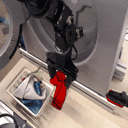
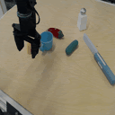
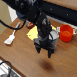
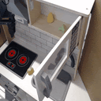
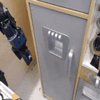
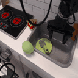
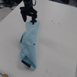
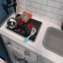
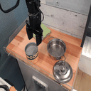

The Bridge Dataset is a large-scale robotic manipulation dataset containing examples 
of a wide variety of manipulations skills in a diverse set of environments. The
data consists of human teleoperated demonstrations mixed with rollouts from 
hand-engineered and learned policies. All the data was collected on a low-cost 
WidowX 250 6DOF robot arm. 

## Statistics

- 33,078 teleoperated demonstrations
- 8,887 rollouts from a scripted policy
- 21 different environments

## Usage and Contributing

We offer two versions of the dataset: a raw version consisting of 640x480 JPEG images or a processed version consisting of downsampled 128x128 images in NumPy files or TFRecord files. 

[This repository](https://github.com/yanlai00/bridge_data_robot_infra) contains 
the robot controller and data collection code. 

Follow the links below to purchase the required equipment:

- [WidowX 250 6DOF robot](https://www.trossenrobotics.com/widowx-250-robot-arm-6dof.aspx)
- [Logitech C920 HD Webcam](https://www.amazon.com/dp/B006JH8T3S)
- [Meta Quest 2 VR Headset](https://www.amazon.com/dp/B099VMT8VZ/) (only needed for data collection)

Please contact [Homer Walke](https://homerwalke.com/) for questions about using the dataset. 

Model training code and a more detailed setup guide will be released soon. 

## Papers

- [Bridge Data: Boosting Generalization of Robotic Skills with Cross-Domain Datasets](https://arxiv.org/abs/2109.13396)
- [Pre-Training for Robots: Offline RL Enables Learning New Tasks from a Handful of Trials](https://arxiv.org/abs/2210.05178)
- [Generalization with Lossy Affordances: Leveraging Broad Offline Data for Learning Visuomotor Tasks](https://arxiv.org/abs/2210.06601)

## Contributors

The following people contributed to the project. 

[Frederik Ebert](https://febert.github.io/), [Aviral Kumar](https://aviralkumar2907.github.io/), [Homer Walke](https://homerwalke.com/), [Anikait Singh](https://asap7772.github.io/), [Yanlai Yang](https://yanlai00.github.io/), [Kuan Fang](http://kuanfang.github.io/), [Patrick Yin](https://patrickyin.me/), [Gengchen Yan](https://www.linkedin.com/in/gengchen-matt-yan), [Kevin Black](https://kevinblack.dev/), [Ashvin Nair](https://ashvin.me/), [Karl Schmeckpeper](https://sites.google.com/view/karlschmeckpeper), [Bernadette Bucher](https://bucherb.github.io/), [Georgios Georgakis](https://ggeorgak11.github.io/), [Kostas Daniilidis](https://www.cis.upenn.edu/~kostas/), [Chelsea Finn](https://ai.stanford.edu/~cbfinn/), [Sergey Levine](https://people.eecs.berkeley.edu/~svlevine/)

We also thank Abraham Lee, Mia Galatis, Caroline Johnson, Christian Aviña, Samantha Huang, and Nicholas Lofrese for collecting data. 

All data is provided under the [Creative Commons Attribution 4.0 International License](https://creativecommons.org/licenses/by/4.0/).
